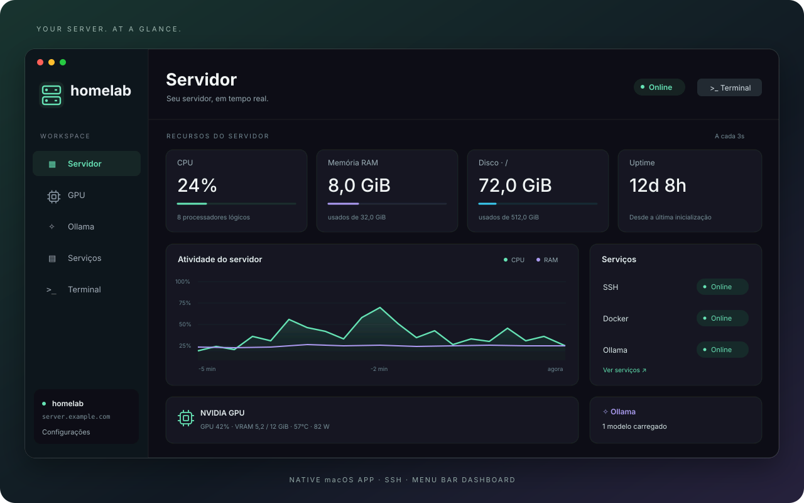

# my-homelab

A native dashboard for monitoring your Linux server from macOS. View system resources, NVIDIA GPU metrics, Ollama models, and services, or open an SSH session — from the main window or directly from the menu bar.

Built with **SwiftUI, AppKit, Swift Charts, and SwiftTerm**. Interface in Brazilian Portuguese. No web interface and no agent to install on the server.



*Illustration with example data. No real server information is shown.*

## Features

- **Server:** connection status, CPU, load average, used/total RAM, root disk usage, and uptime.
- **NVIDIA GPU:** utilization, VRAM, temperature, power, fan speed, clocks, and compute/CUDA processes. Multiple GPU support.
- **Ollama:** API availability, models loaded into memory, VRAM, size, parameters, and quantization.
- **Services:** SSH, Docker, and Ollama. Counts of total containers, running containers, and containers with failing health checks.
- **Terminal:** tabbed SSH sessions, colors, selection, copy/paste, resizing, and font size adjustment.
- **Menu bar:** a compact dashboard with metrics and controls, even when the main window is closed.
- **History:** CPU, RAM, GPU, and VRAM charts covering the last five minutes, kept only in memory.

The `nvidia-smi` and `nvtop` commands supply data to native components; their raw output is not displayed in the monitor.

## Requirements

### Mac

- macOS 14 or later.
- Xcode with Swift 6 or later and the command-line tools selected.
- GitHub access to download dependencies during the first build.

### Server

- Linux with Python 3 and SSH access.
- SSH key/agent authentication for automatic monitoring.
- For the corresponding metrics: NVIDIA driver and `nvidia-smi`, `nvtop` with JSON `--snapshot` support, Docker, and Ollama.

Unavailable optional services are reported without blocking the rest of the dashboard.

## Getting started

```sh
git clone https://github.com/joaoantoniocoelho/my-homelab.git
cd my-homelab
./scripts/build-app.sh
open dist/Homelab.app
```

The script generates the complete application, including its icon, resources, and an ad hoc signature for local use. You can copy `dist/Homelab.app` to **Applications**. The distribution is not notarized by Apple.

For a development build:

```sh
./scripts/build-app.sh debug
```

The build uses `--build-system native` to avoid depending on ahead-of-time Metal shader compilation by Swift Build. SwiftTerm supports loading shaders at runtime. Dependency versions are pinned in `Package.swift` and `Package.resolved`.

## Configuring the connection

The default destination is the generic name **`homelab`**, with no fixed username. In **Settings** (`⌘,`), enter your host/IP, username, and port.

You can also define a host in your **local** `~/.ssh/config` file:

```sshconfig
Host homelab
    HostName server.example.com
    User your-user
    Port 22
```

Replace these values with your server details. In the app, use `homelab` as the host and leave the username empty to inherit it from the SSH configuration. The port entered in the app takes precedence over the SSH file.

A shell alias, such as `alias homelab='ssh ...'`, is not interpreted by the app: use the connection fields or a host defined in `~/.ssh/config`.

The app uses `/usr/bin/ssh`, your existing keys and agent, including `SSH_AUTH_SOCK`. Standard server host key verification is preserved. The app does not implement password storage; authentication is delegated to OpenSSH.

Telemetry uses `BatchMode=yes`. If you need to confirm the server's host key or authenticate interactively, use the app's terminal. For automatic updates, the key must be available to SSH without prompts.

## Usage and refresh intervals

| Group | Default | Available intervals |
|---|---:|---:|
| CPU, RAM, load, GPU, and processes | 3 s | 2–5 s |
| Docker, Ollama, and loaded models | 8 s | 5–10 s |
| Disk and uptime | 45 s | 30–60 s |

Each group runs independent collections, with timeouts and no overlapping requests within the same group. The interval is measured between start times; a slow collection may delay the next one. The menu bar dashboard shares the main window's data without additional queries.

- **Close the window / `⌘W`:** keeps the app in the menu bar, preserving monitoring and SSH sessions. The Dock icon disappears while the window is closed.
- **Pause:** stops data collection while preserving terminal sessions. Reopening the window keeps monitoring paused.
- **Refresh / `⌘R`:** resumes collection and immediately queries all groups.
- **Server → Disconnect all:** pauses monitoring and ends SSH sessions.
- **Power button / `⌘Q`:** quits the application and closes its connections.
- **`⌘1` through `⌘5`:** switch between the main window's screens.

In the menu bar, the GPU, Ollama, and services cards open their detail screens. The footer provides refresh, pause, main dashboard, terminal, settings, and quit controls.

## Where does the data come from?

The Python collector uses only the standard library. It is sent and executed over SSH for each query; it does not install packages, write an agent to the server, or modify its services.

| Data | Source and interpretation |
|---|---|
| CPU | Delta of `/proc/stat` counters, sampled over at least 250 ms. Guest time is not counted twice. |
| RAM | `/proc/meminfo`: used = `MemTotal − MemAvailable`. |
| Load | Linux load average over 1, 5, and 15 minutes. |
| Disk | Filesystem mounted at `/`, via `shutil.disk_usage`. |
| Uptime | `/proc/uptime`. |
| GPU | `nvidia-smi --query-gpu`, as structured CSV. |
| CUDA processes | `nvidia-smi --query-compute-apps`. |
| Clocks | `nvtop --snapshot`, as JSON. |
| Containers | `docker ps --all --format '{{json .}}'`. |
| Docker service | `systemctl show docker.service`, as a fallback when the Docker API is inaccessible. |
| Ollama | `GET http://127.0.0.1:11434/api/ps`, accessed from within the server. |

### Interpreting the metrics

- **Installed does not mean loaded:** the Ollama dashboard lists models in RAM/VRAM. Models only stored on disk do not appear in this list.
- **CPU is a short sample:** it may differ from `top` and include the work performed by monitoring itself.
- **Units:** RAM, disk, and VRAM are shown in MiB/GiB; rounded numbers may differ from tools configured to use MB/GB.
- **Disk:** other volumes are not added to root disk usage.
- **GPU processes:** the list covers compute/CUDA, not all graphics processes.
- **nvtop:** versions without JSON snapshots do not provide clocks. The remaining NVIDIA metrics stay available. Clocks are matched by name only when that name is unique, because the snapshot does not provide a UUID.
- **Docker:** the total includes stopped containers; `running` counts `State == running`; `unhealthy` counts `(unhealthy)` in `Status`. Containers without health checks are not considered tested. If the SSH user cannot query the API, counts are unavailable; the app does not use `sudo` or change permissions.
- **Failures and pause:** the last result may remain visible with a warning. Check the last collection indicator. Missing metrics are shown as `—`.

## Tests

Local tests, without requiring a server:

```sh
swift test --build-system native
python3 -m unittest discover -s Tests -p 'test_*.py' -v
```

These cover parsing, missing data, response framing, connection validation, quoting, timeouts/cancellation, CSV, Docker counters, and collection group isolation.

After configuring the `homelab` SSH alias, validate all three groups against the server:

```sh
dist/Homelab.app/Contents/MacOS/Homelab --smoke-test
```

This command uses the default destination `homelab` and port 22, not the interface's saved preferences.

To verify rendering and window closing/reopening, with the app not running:

```sh
open dist/Homelab.app --args --capture-ui /tmp/homelab-preview
```

This routine captures only the app's own screens, opens an SSH session, and checks that collection, pause state, and the session are preserved when closing/reopening. **The images contain real server data; do not publish them without reviewing them.**

## Privacy and local files

- The repository's default configuration contains no IP address, SSH username, or credentials for a specific server.
- Connection preferences are stored in macOS `UserDefaults`, outside the project. Metric history stays in memory.
- The collector accesses the Ollama API through the server's loopback interface; it does not need to be exposed on the network.
- `.gitignore` excludes builds, generated applications, caches, environment files, common key formats, captures, and local logs.
- Do not add SSH keys, passwords, tokens, configuration exports, dumps, captures, or terminal recordings without reviewing their contents. `.gitignore` does not detect secrets embedded in code or protect files added by force.

## Structure

```text
Sources/Homelab/          Interface, menu bar, SSH sessions, and scheduling
Sources/HomelabCore/      Connection, models, process execution, and Python collector
Tests/                   Swift and Python tests
Resources/               Application metadata
scripts/                 Build, packaging, and icon generation
```

The terminal uses [SwiftTerm](https://github.com/migueldeicaza/SwiftTerm), licensed under MIT. The dependency's license is included in the generated app.
